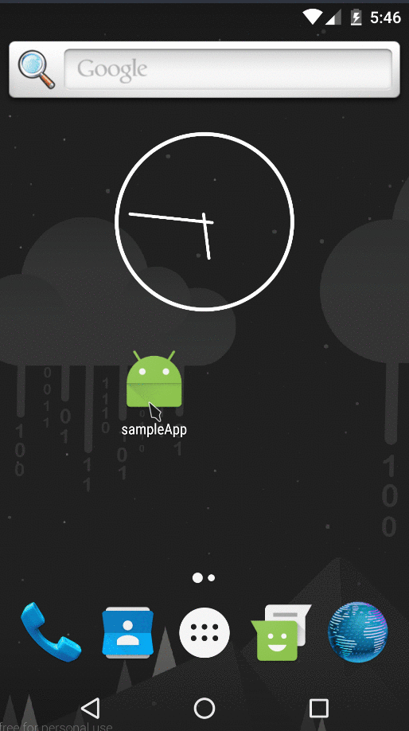

# Sample App
#### Features
* eslint-config-airbnb linting. (https://github.com/airbnb/javascript/tree/master/packages/eslint-config-airbnb)
* Redux (redux-thunk (https://github.com/gaearon/redux-thunk), redux-logger)
* Immutable.js (https://facebook.github.io/immutable-js/)
* react-native-router-flux (https://github.com/aksonov/react-native-router-flux)

#### Description

React Native boilerplate with authorization and persistent login.

<p align="center">
  
</p>

### Installation
- <b>Mobile App</b>

  Clone the repository and run the following commands under your project root:
  Must have react-native installed. (https://facebook.github.io/react-native/docs/getting-started.html)
  ```
  npm i
  ```
  Connect a device or use virtual device (https://www.genymotion.com/) and run:
  ```
  react-native run-android
  react-native start
  ```
- <b>Server</b>

  Navigate to sampeServer folder.
  Run the following commands in sampleServer folder:
  ```
  npm i
  node server.js
  ```
  <b>Change apiEndpoint in root/app/urls.js to match server address</b>
